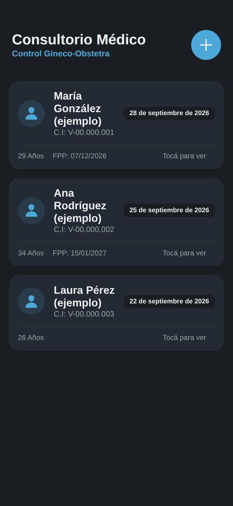
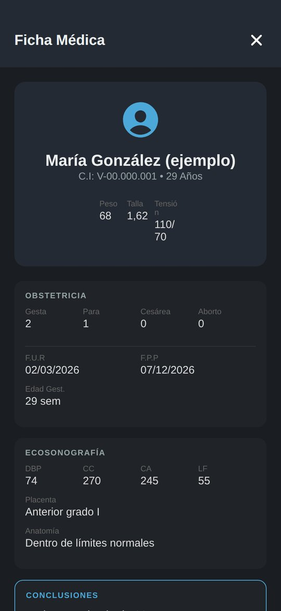
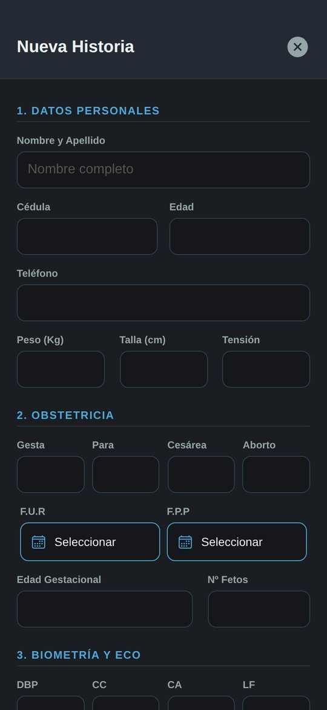

# 🩺 Agenda de Consultorio Médico (Gineco-Obstetricia)

App móvil para que un consultorio de ginecología y obstetricia lleve las **historias clínicas** de sus pacientes desde el teléfono: datos personales, control obstétrico, ecosonografía, diagnóstico y próxima cita.


---

## 📸 Capturas

<p align="center">
  
  
  
</p>
<p align="center"><sub>Lista de pacientes · Ficha médica · Formulario de nueva historia (datos de ejemplo)</sub></p>

---

## ✨ Funcionalidades

- 📋 **Ficha médica** en 4 secciones: datos personales · obstetricia · biometría y ecosonografía · diagnóstico y conclusiones.
- 📅 **Próxima cita** con selector de fecha nativo.
- 🔍 Listado de pacientes con vista de detalle tipo informe.
- ✏️ Crear, editar y eliminar historias.
- 💾 Datos guardados **solo en el dispositivo** (`AsyncStorage`): nada de información clínica sale del teléfono.
- 🌙 Tema oscuro moderno.

## 🚀 Cómo ejecutarlo

```bash
npm install
npx expo start          # escanea el QR con Expo Go
```

### Probar sin compilar (Expo Go)

Instala **Expo Go** desde Play Store / App Store, ejecuta `npx expo start` y escanea el QR.

## 📦 Generar el APK para instalar en Android

No necesitas Android Studio: el APK se compila gratis en la nube con **EAS Build** de Expo.

```bash
npm install -g eas-cli        # una sola vez
eas login                     # cuenta gratis en expo.dev
eas build:configure           # solo la primera vez (vincula el proyecto a TU cuenta)
eas build -p android --profile preview
```

Al terminar (10-20 min) EAS muestra un **enlace y un código QR** para descargar el `.apk`; ábrelo en el teléfono e instálalo (permite "orígenes desconocidos").


| Opción | Comando | Resultado |
|---|---|---|
| APK para instalar directo | `eas build -p android --profile preview` | `.apk` |
| Publicar en Google Play | `eas build -p android --profile production` | `.aab` |
| Compilar en tu PC (requiere Android Studio) | `npx expo run:android --variant release` | `.apk` local |

## Autor

**Dominic De Freitas** — Ingeniero en Informática (UGMA). Desarrollo aplicaciones móviles y web con React Native, TypeScript, Node.js y Python, y busco mi primer puesto como desarrollador junior remoto.

[Perfil de GitHub](https://github.com/dominic0285) · [LinkedIn](https://www.linkedin.com/in/dominic-de-freitas-07102828a/) · dominicdefreitasfd@gmail.com
